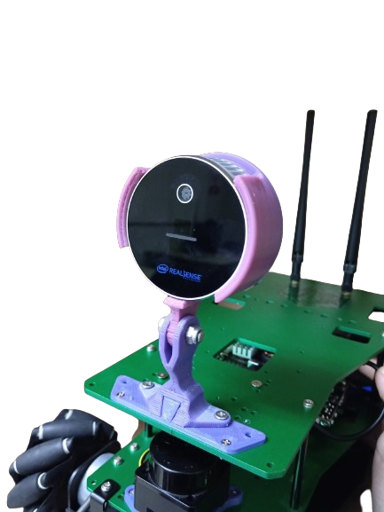

  # Yahboom ROSMASTER X3 PLus

  

ROSMASTER X3 PLUS is an omnidirectional motion robot developed based on the ROS robot operating system.
Supports four controllers: Jetson NANO 4GB/Xavier NX/TX2 NX and Raspberry Pi 4B.
It is equipped with high-performance hardware configurations such as lidar, depth camera, high-power 520 motor, interactive voice recognition module and 7-inch HD screen.
It can realize applications such as mapping and application navigation, automatic driving, human feature recognition.
Support remote control of mobile phones, handles, computer keyboards.

## :books: Package Summary

